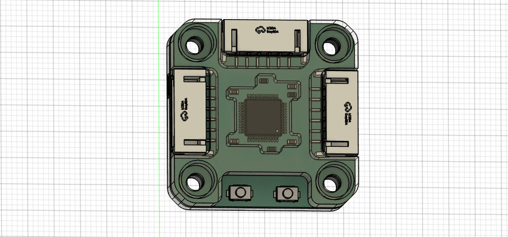
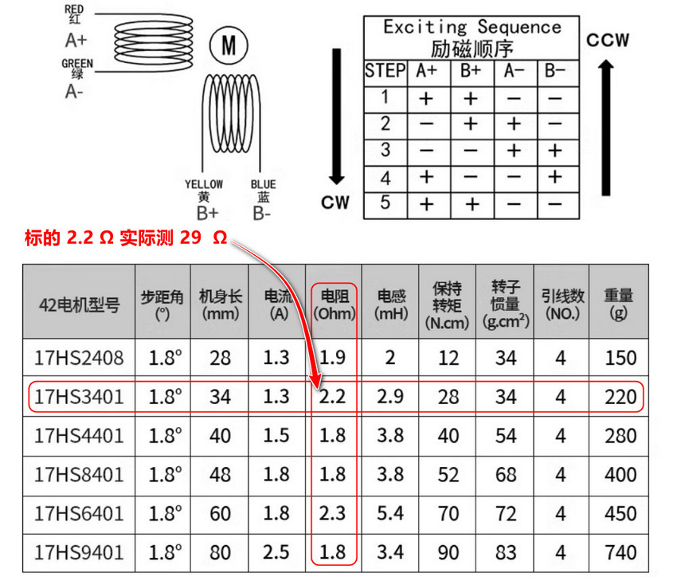
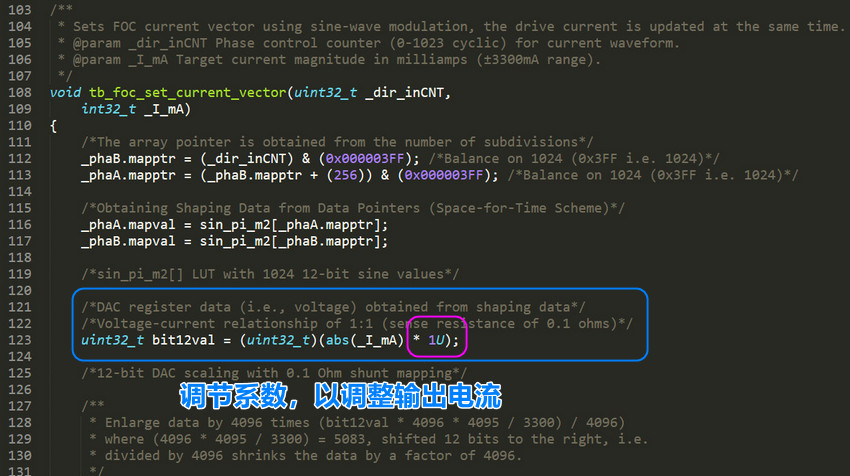

# Motor35

支持闭环控制的步进电机，达到伺服电机高精度高速不丢步的特性，闭环控制器的控制输入基于 CAN 总线协议实现，支持位置闭环，速度闭环，电流闭环（实现恒定扭矩），在位置控制模式下精度可达 0.02mm。

控制器预留了双电源口和双 CAN 口，可以以串联的形式将多个电机级联，使得所有电机连线仅需要四根（两条电源，两条 CAN 信号线）。

## 总线控制优点

(1) 另外总线控制方式电机可以工作在力矩，速度，位置，轨迹模式下，而脉冲模式只能工作在位置和轨迹模式，无法进行复杂控制。

(2) 改进脉冲形式控制多个电机控制时每个电机都需要独立 Step/Dir 信号线导致部分电机走线很长走线极其不优雅的问题。

## 校准操作

## 控制协议

其他的功能要通过代码或者通信协议设置，比如设置 Home 零点，调试闭环控制 PID 参数，级联控制时需要的 CAN 节点 ID，以及各种运动参数等等。

## 震动问题

注意步进驱动器控制步进电机工作在位置环并要求静止在某个固定位置时可能会出现高频震动的问题。

引起高频微弱震动的原因是由于在位置环控制模式下，驱动器为了让让电机接近指定位置而控制电机在齿槽间反复微调而产生震动。

这个现象排除驱动器的电路问题（比如焊接的电流采样电阻是否正确等等），磁编码器检测磁铁的安装同心度问题（通常同心度要求不是很高，确保不要过度偏移即可）那有极大的可能是步进电机的相电阻过大导致的，可以更换了其他电机进行测试。

如果更换电机测试后发现同一个闭环步进电机驱动器驱动一个步进电机工作在位置环保持静止时工作正常，而驱动另一个步进电机静止时出现高频震动，那可以肯定就是相电阻过高而导致的。

出现震动现象的电机相电阻通常为 10-30 Ohm，而较好电机的相电阻通常为 2-5 Ohm。比如在上图中购买的步进电机在参数描述中标明的相电阻为 2.2 Ohm，实则实际测出的相电阻高达 29 Ohm，所以电机出现震动现象和线圈相电阻是有一定关系的。

如果不更换电机的情况下可以通过修改驱动器程序固件来修复这个问题，修改驱动输出部分，在最终 FOC 输出驱动电流部分添加一个系数即可，通过该系数来调节驱动器 FOC 的输出电流，如下图。

当然调节电流参数会对最终的扭矩有略微的影响，但并不影响闭环精度。
